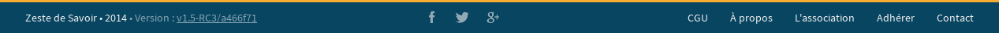
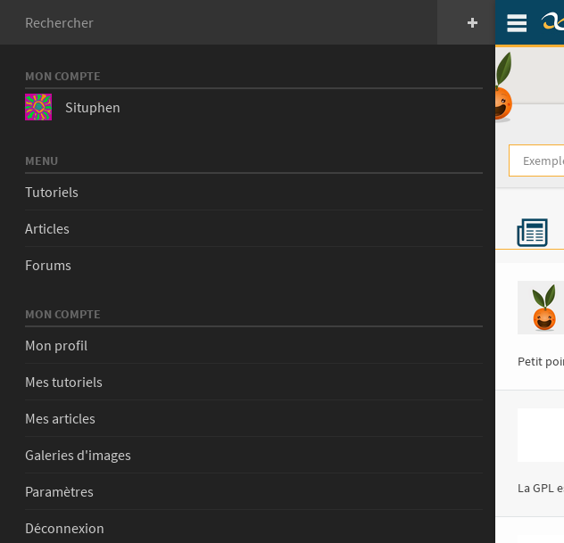
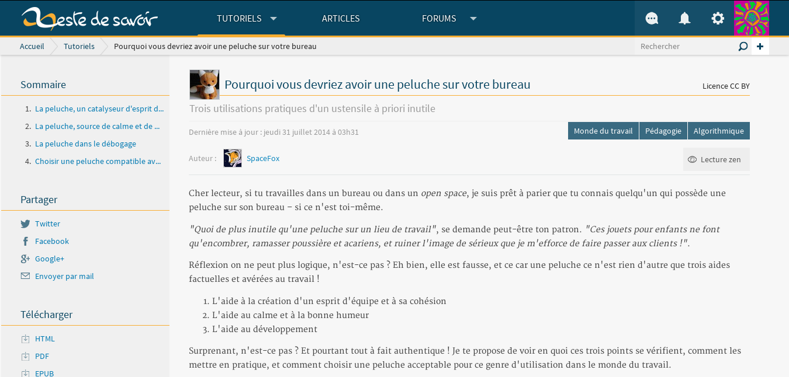

=========
Le design
=========

Structure globale du site
=========================

Le site est composé de plusieurs grandes parties.

L'en-tête
---------

.. figure:: images/design/en-tete.png
   :align: center

On peut découper l'en-tête du site en quatre.

Le logo
~~~~~~~

Le logo est simplement un lien qui a pour contenu une image. L'image change en fonction de la taille de l'écran.

Le menu
~~~~~~~

Le menu est composé soit d'un lien, soit d'un menu déroulant. Ces derniers contiennent des listes de liens.

.. figure:: images/design/en-tete_menu.png
   :align: center

La *logbox*
~~~~~~~~~~~

La *logbox* contient trois menus déroulants :

- le premier affiche les messages privés ;
- le deuxième affiche les notifications ;
- et le dernier contient des liens vers les zones réservées à l'utilisateur.

.. figure:: images/design/en-tete_logbox.png
   :align: center

Le fil d'ariane
~~~~~~~~~~~~~~~

Le fil d'ariane est en deux partie :

- à gauche, une aide à la navigation ;
- à droite, un petit formulaire de recherche.

La barre latérale
-----------------

La barre latérale contient des listes de liens, boutons ou formulaires permettant à l'utilisateur d'effectuer des actions.

.. figure:: images/design/barre-laterale.png
   :align: center

   Barre latérale de la page d'un profil

Le contenu principal
--------------------

Le contenu principal change radicalement suivant les pages, comme son nom l'indique, il contient le contenu principal, important.

Le bas de page
--------------

Le bas de page est sûrement la partie la plus simple du site. Il contient trois *flexboxs* :

- celui de gauche affiche le nom du site ;
- celui du milieu contient les liens vers les comptes des réseaux sociaux du site ;
- celui de droite contient des liens vers les pages annexes du site, tel que les CGUs par exemple.

Le menu pour mobile
-------------------

Le menu pour mobile est généré en javascript à partir de l'en-tête et de la barre latérale. `Le code est disponible sur Github. <https://github.com/zestedesavoir/zds-site/blob/dev/assets/js/mobile-menu.js>`_

Quelques éléments propres au site
=================================

Les boîtes modales
------------------

Une boîte modale est une pseudo-fenêtre qui s'affiche au clique de certains boutons. Elle a pour but de faire confirmer un choix à l'utilisateur ou de permettre à celui-ci de remplir un formulaire.

.. figure:: images/design/boite-modale_mp.png
   :align: center

   La boîte modale pour ajouter un participant à un message privé

.. figure:: images/design/boite-modale_desinscription.png
   :align: center

   La boîte modale pour confirmer sa désinscription

La lecture zen
--------------

La lecture zen est un mode d'affichage des tutoriels et des articles permettant à l'utilisateur de se concentrer sur sa lecture. Elle cache l'en-tête et la barre latérale de la page pour ne laisser que le contenu principal. Techniquement, c'est un mélange de javascript et de (S)CSS.

   Un tutoriel sans lecture zen

.. figure:: images/design/lecture-zen_on.png
   :align: center

   Ce même tutoriel avec lecture zen

Arborescence des dossiers
=========================

Nous utilisons deux dossiers présents à la racine :

- ``templates/`` pour les fichiers HTML, qui sont agrémentés du `langage de gabarit de Django <https://docs.djangoproject.com/fr/1.7/topics/templates/>`_ ;
- ``assets/`` pour les images, les smileys et les fichiers SCSS et JS.

Lors du "build", un dossier ``dist/`` contenant les fichiers optimisés venant de ``assets/`` est créé.

``templates/``
--------------

Voici un extrait du dossier contenant les gabaris :

.. sourcecode:: bash

    templates/
    ├── tutorial/ # Dossier contenant les gabaris des pages des tutoriels
    │   ├── tutorial/
    │   ├── chapter/
    │   │   ├── edit.html
    │   │   ├── new.html
    │   │   ...
    │   ├── extract/
    │   │
    │   ├── base.html
    │   ├── export.html
    │   ...
    │
    ├── pages/ # Dossier contenant les pages du site
    │   ├── about.html
    │   ├── contact.html
    │   ...
    │
    ├── misc/ # Dossier contenant des fichiers utilisés dans plusieurs modules
    │   ├── zen_button.part.html
    │   ├── previsualization.part.html
    │   ...
    ...

``assets/``
-----------

Voici un aperçu du dossier :

.. sourcecode:: bash

    assets/
    ├── images/
    │   ├── sprite/ # Images qui seront dans le sprite
    │   │   ├── arrow-right.png
    │   │   ├── arrow-right-blue.png
    │   │   ...
    │   │
    │   │ # Autres images
    │   ├── favicon.ico
    │   ├── favicon.png
    │   ├── logo@2x.png
    │   ├── logo.png
    │   ...
    │
    ├── js/
    │   ├── vendors/ # Toutes les bibliothèques (disponibles après l'installation des outils)
    │   │   ├── jquery.js
    │   │   ...
    │   │
    │   ├── accessibility-links.js
    │   ├── data-click.js
    │   ...
    │
    ├── scss/
    │   ├── layout/
    │   │   ├── _header.scss
    │   │   ├── _sidebar.scss
    │   │   ...
    │   ├── components/
    │   │
    │   ├── main.scss # Fichier de configuation
    │   ├── sprite-template.mustache # Fichier servant à la génération sprite
    │   ...
    │
    └── smileys/
        ├── ange.png
        ├── angry.gif
        ...

``dist/``
---------

Voilà à peu près ce qui est généré lors du "build" :

.. sourcecode:: bash

    dist/
    ├── css/
    │   ├── main.css # Tout le CSS compilé...
    │   └── main.min.css # ...et minimisé
    │
    ├── images/ # Toutes les images optimisées
    │   ├── favicon.ico
    │   ├── favicon.png
    │   ├── logo@2x.png
    │   │
    │   ├── sprite@2x.png # Sprite haute définition
    │   ├── sprite.png # Sprite moyenne définition
    │   ...
    │
    ├── js/
    │   ├── vendors/ # Toutes les bibliothèques non-minimisées
    │   │   ├── jquery.js
    │   │   ...
    │   ├── vendors.js # Toutes les bibliothèques rassemblées...
    │   ├── vendors.min.js # ...et minimisées
    │   │
    │   ├── main.js # Tout le JS customisé rassemblé...
    │   ├── main.min.js # ...et minimisé
    │   │
    │   ├── all.js # Tout le JS rassemblé...
    │   └── all.min.js # ...et minimisé
    │
    └── smileys/
        ├── ange.png
        ├── angry.gif
        ...

Glossaire
=========

- *flexbox* : modèle de boîte flexible en HTML/CSS (`voir le tutoriel sur Alsacréations <http://www.alsacreations.com/tuto/lire/1493-css3-flexbox-layout-module.html>`_)