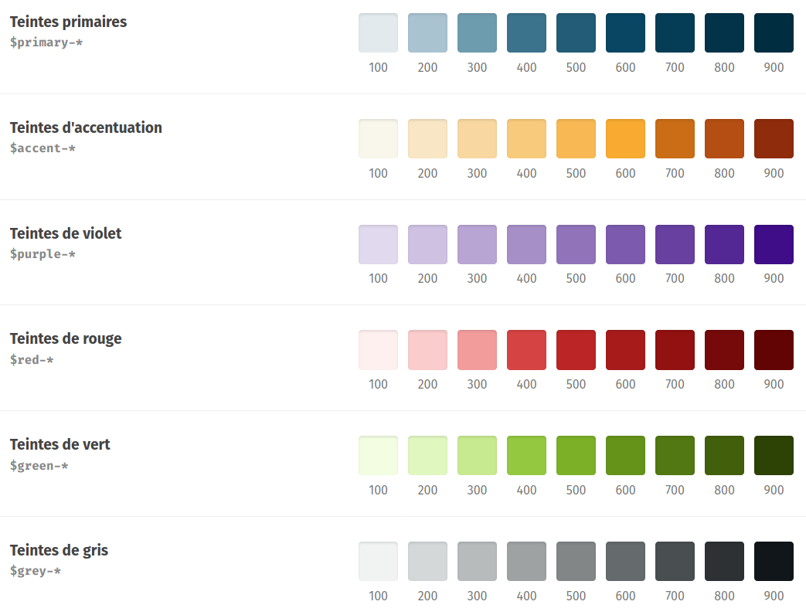

========================================
Charte de l'interface de Zeste de Savoir
========================================

Afin de garantir une cohérence à l'interface de Zeste de Savoir, plusieurs
éléments graphiques sont normés. On ne parle pas ici de composants graphiques
tel des boutons, des dialogues…, mais plutôt des éléments graphiques qui les
composent : couleurs, polices, tailles, ombres…

Tout développement graphique sur Zeste de Savoir **doit** respecter cette norme.

.. note::
   Pourquoi tant de normes ?

   Le premier argument a déjà été cité : garantir une certaine cohérence à
   l'interface de Zeste de Savoir. Il y en a un second : ne pouvoir choisir
   que parmi une liste restreinte de possibilités permet de gagner du temps :
   on ne passe plus deux heures à essayer toutes les valeurs possibles entre
   deux tailles ou deux couleurs ; on prend la plus proche qui rend bien et
   *voilà*. Aussi, ça évite de *deviner* quelle valeur choisir au hasard.

Couleurs
========

Zeste de Savoir utilise une palette de couleurs limitée. Lorsque vous choisissez
une couleur pour quelque chose, vous devez piocher dedans.

.. seealso::
   Cette palette est également `disponible en version interactive <https://amaurycarrade.github.io/palette-zds/>`_.

La palette est rendue disponible dans le code SCSS du site sous la forme de
variables prêtes à l'emploi. Les noms des variables sont indiquées sur
l'illustration plus haut, en combinant le nom indiqué sous le titre avec le
numéro de la couleur (par exemple ``$purple-400``), et peuvent être copiés au
clic sur la version interactive.

Ainsi, n'écrivez pas :

.. sourcecode:: scss

   .smoothie {
       color: #F0B429;
   }

Mais plutôt :

.. sourcecode:: scss

   .smoothie {
       color: $accent-400;
   }

.. attention::

   Comme seules les couleurs de la palette doivent être utilisées, **vous ne
   devez pas utiliser les fonctions de traitement de couleur de Sass**
   (``lighten``, ``darken``, ``saturate``, ``desaturate``…). Si une couleur de
   votre choix vous semble trop claire ou trop sombre, utilisez la couleur d'à
   côté dans la palette.
