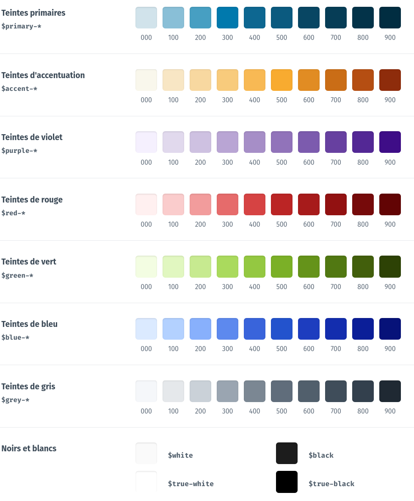
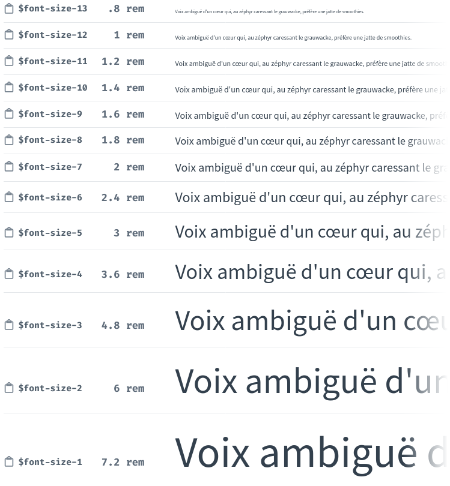

========================================
Charte de l'interface de Zeste de Savoir
========================================

Les styles de Zeste de Savoir sont complexes, formés de l'empilement d'années
de contributions par des personnes très différentes. Pour qu'ils restent
maintenables, ce document propose une norme et des recommandations.

Normalisation des styles
========================

Afin de garantir une cohérence à l'interface de Zeste de Savoir, plusieurs
éléments graphiques sont normés. On ne parle pas ici de composants graphiques
tels des boutons, des dialogues…, mais plutôt des éléments graphiques qui les
composent : couleurs, polices, tailles, ombres…

Tout développement graphique sur Zeste de Savoir **doit** respecter cette norme
(avec quelques exceptions mentionnées ci-après).

.. note::
   Pourquoi tant de normes ?

   Le premier argument a déjà été cité : garantir une certaine cohérence à
   l'interface de Zeste de Savoir. Il y en a un second : ne pouvoir choisir
   que parmi une liste restreinte de possibilités permet de gagner du temps :
   on ne passe plus deux heures à essayer toutes les valeurs possibles entre
   deux tailles ou deux couleurs ; on prend la plus proche qui rend bien et
   *voilà*. Aussi, ça évite de *deviner* quelle valeur choisir au hasard.

   On peut enfin ajouter un troisième argument : ces normes ont été étudiées
   dans une optique d’accessibilité — à supposer qu'elles soient correctement
   utilisées (elles ne dispensent pas de vérifier les contrastes, par exemple).

.. note::
   Toutes ces normes sont `récapitulées sur un site web compagnon à la conception
   d'interfaces pour Zeste de Savoir <https://zestedesavoir.github.io/normes-graphiques/>`_,
   avec moyen de copier facilement les variables SCSS et d'estimer la couleur la
   plus proche de la palette automatiquement.

   **Vous travaillez sur ZdS sans accès à internet ?** Ce site web compagnon
   fonctionne même hors-ligne, à condition de l'avoir chargé une fois dans votre
   navigateur — retournez simplement sur le site même sans connexion.

.. note::
   Un `paquet npm <https://www.npmjs.com/package/zestedesavoir-standards>`_ est également
   disponible si vous voulez réutiliser ces normes dans des projets affiliés à Zeste de
   Savoir.

Couleurs
--------

Zeste de Savoir utilise une palette de couleurs limitée. Lorsque vous choisissez
une couleur pour quelque chose, vous devez piocher dedans.

.. seealso::
   Cette palette est également `disponible en version interactive <https://zestedesavoir.github.io/normes-graphiques/#couleurs>`__,
   avec un outil pour déterminer la couleur la plus proche d'une couleur donnée
   dans la palette.

La palette est rendue disponible dans le code SCSS du site sous la forme de
variables prêtes à l'emploi. Les noms des variables sont indiquées sur
l'illustration plus haut, en combinant le nom indiqué sous le titre avec le
numéro de la couleur (par exemple ``$purple-400``), et peuvent être copiés au
clic sur la version interactive.

Ainsi, n'écrivez pas :

.. sourcecode:: scss

   .smoothie {
       color: #F0B429;
   }

Mais plutôt :

.. La coloration syntaxique ne comprend pas le dollar (cf https://github.com/pygments/pygments/issues/2130), donc pas de langage précisé
.. sourcecode::

   .smoothie {
       color: $accent-400;
   }

.. attention::

   Comme seules les couleurs de la palette doivent être utilisées, **vous ne
   devez pas utiliser les fonctions de traitement de couleur de Sass**
   (``lighten``, ``darken``, ``saturate``, ``desaturate``…). Si une couleur de
   votre choix vous semble trop claire ou trop sombre, utilisez la couleur d'à
   côté dans la palette.

.. attention::
   La seule exception à cette règle est le cas de couleurs de marque (par exemple,
   la couleur du bouton de connexion via Google ou Facebook). S'il manque des couleurs,
   il est toujours possible de réfléchir à ajuster la palette, mais vue la diversité
   proposée c'est relativement peu probable.

Polices
-------

Zeste de Savoir utilise trois polices de caractères sur le site :

- une police sans empattement (``$font-sans-serif``), pour les textes de l'interface (il s'agit
  de Source Sans Pro, par défaut) ;
- une police avec empattements (``$font-serif``), pour les contenus (cours, articles et billets)
  (Merriweather) ;
- une police à chasse fixe (``$font-monospace``), pour les codes sources notamment (Source Code Pro).

Vous pouvez utiliser ces polices via les variables SCSS sus-citées, qui incluent aussi les
polices alternatives.

Concernant les **tailles** de texte, elles sont également normalisées. Vous pouvez utiliser ces tailles
(avec ces variables SCSS).

.. seealso::
   Cette liste est également `disponible en version interactive <https://zestedesavoir.github.io/normes-graphiques/#polices>`__,
   avec prévisualisation pour les trois familles de police utilisées.

Longueurs
---------

Les longeurs des marges internes et externes, des tailles des blocs, des positionnements, …, sont
également normalisées. Cela permet d'avoir une impression de cohérence globale à travers le site,
en évitant d'utiliser toutes les longueurs existantes de façon aléatoire et chaotique.

Vous pouvez utiliser ces longeurs (avec ces variables SCSS, si vous voulez). Le numéro dans le nom
de la variable correspond à la longueur en pixels (ou en dixième de ``rem``).

.. seealso::
   Cette liste est également `disponible en version interactive <https://zestedesavoir.github.io/normes-graphiques/#longueurs>`__.

.. attention::
   Cette norme peut être ignorée s'il s'agit d'aligner des éléments au pixel près. Cela dit, un code
   CSS moderne ne devrait pas nécessiter ce genre de choses. Par contre, certains éléments plus anciens
   du code de Zeste de Savoir sont concernés, et cette norme ne doit pas être un frein s'il s'agit de les
   faire évoluer.

Ombres
------

Si un élément doit recevoir une ombre, utilisez l'une des six ombres standardisées ci-dessous. Plusieurs avantages :

- ce sont des mixins, donc vous n'aurez pas à vous embêter à écrire le ``box-shadow`` alambiqué, simplement ``@import shadow-1`` ;
- ces ombres sont conçues pour être naturelles, correspondant à une réelle ombre portée par une source de lumière unique.

.. seealso::
   Cette liste est également `disponible en version interactive <https://zestedesavoir.github.io/normes-graphiques/#ombres>`__.

Arrondis
--------

Si un élément doit avoir des coins arrondis, utilisez l'un de ces arrondis. Le dernier est configuré à une très
grande valeur pour les cas où vous désirez avoir un élément circulaire (veuillez noter que pour qu'il soit effectivement
circulaire, l'élément devra avoir des dimensions carrées).

.. seealso::
   Cette liste est également `disponible en version interactive <https://zestedesavoir.github.io/normes-graphiques/#arrondis>`__.

Recommandations pour un SCSS propre
===================================

Ces recommandations ne sont pas *obligatoires*, mais elles permettent d'assurer une cohérence du code SCSS
du site et une plus grande facilité à rentrer dedans lorsque l'on est extérieur au projet.

Utilisez *flexbox* et les grilles
---------------------------------

CSS dispose de beaucoup d'options pour positionner les éléments les uns par rapport aux autres, mais certaines
sont plus maintenables que d'autres. Il est recommandé **d'éviter au plus possible d'utiliser des positionnements
absolus et des flottants**, au profit des outils CSS modernes et largement supportés que sont les
`*flexboxes* <https://developer.mozilla.org/fr/docs/Apprendre/CSS/CSS_layout/Flexbox>`_ et les
`grilles CSS <https://developer.mozilla.org/fr/docs/Apprendre/CSS/CSS_layout/Grids>`_.

Conteneurisez le CSS
--------------------

Non, chers *aficionados* de Docker, on ne parle pas de ça ici.

Lorsque vous stylisez un élément en CSS, assurez-vous de ne styliser *que* ce que vous voulez. Évitez les règles
avec une application beaucoup trop large qui affectent tout le site : ces règles ont tendance à être une horreur
à maintenir, car elles font des effets de bord de partout, et la moindre modification peut casser une page
totalement improbable à l'autre bout du site.

Ainsi, préférez mettre tout le CSS stylisant un composant dans une classe parente unique dans le projet, par exemple :

.. sourcecode:: scss

   .your-component {
      // Tout le CSS de ce composant là dedans, rien en dehors
      // Ainsi il ne pourra contaminer le reste du site
   }

Si vous avez un composant avec de légères variations ça et là en fonction de son usage, bien sûr, ne réinventez pas la roue.
Vous pouvez par exemple utiliser le modèle de Bulma, assez effiace, de modificateurs :

.. sourcecode:: scss

   .your-component {
      // Tout le CSS de la version “de base”

      &.is-light {
         // CSS pour la version “light”
      }

      &.is-small {
         // CSS pour une petite version
      }

      &.has-dreams {
         // CSS pour la version qui a des rêves (?)
      }
   }

…ce qui permet de les appliquer facilement à l'usage (en plus, c'est plutôt lisible).

.. sourcecode:: html

   

      <!-- ... -->
   

Pensez à l'ordre des propriétés CSS
-----------------------------------

Les navigateurs n'ont cure de l'ordre de déclaration des propriétés CSS (tant que les mêmes ne sont pas déclarées
plusieurs fois), mais les placer dans un ordre logique aide grandement à la lecture du code, permettant plus facilement
de saisir en un coup d'œil ce qui est déclaré, les éléments similaires étant groupés ensemble.

Chacun⋅e aura sa logique, mais en voici une à titre indicatif :

1. positionnements (``position``, ``top``, ``left``, ``z-index``…) ;
2. affichage et modèle de boîte (``display``, ``overflow``, ``box-sizing`` ; ``width``, ``height``, ``margin``,
   ``padding`` ; ``border``, ``border-radius``…) ;
3. couleurs (``background``, ``color``…) ;
4. texte (``font-family``, ``font-size``, ``line-height``, ``text-align``, ``text-transform``…) ;
5. *les autres* (``cursor``…) ;
6. transformations et transitions, à la toute fin (``animate``, ``transition``, …).

Et `en voici une autre <https://9elements.com/css-rule-order/>`_. L'important reste que le code source soit clair et
scannable facilement.
