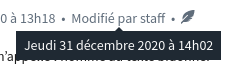
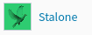
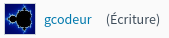
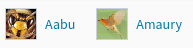
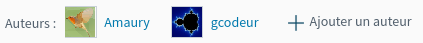
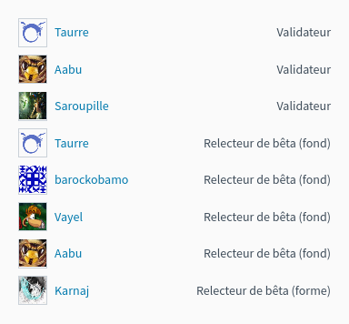
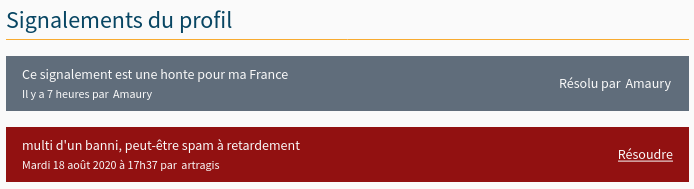

============================
Eléments spécifiques au site
============================

Les boîtes modales
==================

Une boîte modale est une pseudo-fenêtre qui s'affiche au clique de certains boutons. Elle a pour but de faire confirmer un choix à l'utilisateur ou de permettre à celui-ci de remplir un formulaire.

.. figure:: ../images/design/boite-modale_mp.png
   :align: center

   La boîte modale pour ajouter un participant à un message privé

Une boîte modale est un élément HTML avec la classe CSS ``modal``. Mais ce ne serait pas drôle s'il n'y avait pas des
spécificités suivant les cas d'utilisation !

Cas courant : quand c'est un formulaire
---------------------------------------

On utilise souvent les boîtes modales avec un formulaire que ce soit pour confirmer une action (par exemple,
une suppression) ou pour demander à l'utilisateur de remplir des champs de texte (par exemple, ajout de nouveaux
participants à une discussion ou nouveaux auteurs à un tutoriel) !

Il arrive souvent d'avoir donc ceci :

.. sourcecode:: html+django

   <form action="{{ url }}" method="post" id="une-ancre" class="modal modal-flex">
       Voici un formulaire !

       <textarea>Voici un champ de texte...</textarea>

       <input type="submit">Voici un bouton</input>
   </form>

On a ici un bouton pour envoyer le formulaire. Mais comment l'utilisateur ferme la boîte modale ?
Il peut cliquer en-dehors de la boîte ou bien presser la touche "Échape", mais il y a plus simple.
En effet, un bouton "Annuler" est automatiquement ajouté pour que l'utilisateur puisse fermer la
boîte modale très simplement !

Cas particulier : quand ce n'est pas un formulaire
--------------------------------------------------

On peut se dire qu'avec ce code tout va bien fonctionner :

.. sourcecode:: html+django

   

       Une super boîte modale !
   

Malheureusement, non : le bouton de fermeture ne prend que la moitié de la place ! Ce problème se résout
très rapidement en ajoutant l'attribut ``data-modal-close="Fermez-moi !"`` à la boîte modale. Le texte
de l'attribut (ici ``Fermez-moi !``) deviendra le texte du bouton.

.. sourcecode:: html+django

   

       Une super boîte modale !
   

Si on désire un second bouton pointant vers un lien arbitraire, il suffit d'ajouter à la fin de l'élément
contenant la boîte un lien avec les classes ``btn`` et ``btn-submit`` ; il sera automatiquement ajouté
à côté du bouton de fermeture de la modale.

.. sourcecode:: html+django

   

       Une super boîte modale !
        <a class="btn btn-submit" href="#">Cliquez moi !</a>
   

Créer le lien
-------------

La création du lien affichant la boîte modale est tout aussi simple : il suffit
de mettre une ancre correspondant à l'``id`` de la boîte modale ainsi que la
classe ``open-modal``. N'oubliez pas l'attribut ``aria-haspopup="dialog"`` pour
l'accessibilité.

.. sourcecode:: html+django

   <a href="#une-ancre" class="open-modal" aria-haspopup="dialog">
       Un super lien !
   </a>

.. Attention::

   Le texte du lien sera le titre de la boîte modale, sauf si explicitement spécifié (voir ci-dessous).

Quand le texte du lien n'est pas le titre
-----------------------------------------

Si vous voulez un autre titre que le texte du lien pour votre modale, vous pouvez ajouter
l'attribut ``data-modal-title="Le titre de ma boîte"`` à la boîte modale. Le texte
de l'attribut (ici ``Le titre de ma boîte``) deviendra le titre de la boîte modale.

.. sourcecode:: html+django

   

       Une super boîte modale !
   

Les tailles des modales
-----------------------

Par défaut, les modales vont prendre tout l'écran en largeur, mais en ajoutant une classe ``modal-flex``, la modale va prendre la taille du contenu, avec comme taille minimum 400px. La modale va automatiquement s'adapter en hauteur et en largeur. Si une modale prend quand même toute la taille en largeur, c'est sûrement que le contenu de votre modale a une taille à 100% !

API Javascript pour manipuler les modales
-----------------------------------------

Il est possible de créer des modales en Javascript. Exemple:

.. sourcecode:: javascript

  var m = new Modal({
      title: "Titre de la modale",
      body: "
Contenu de la modale
", // Peut être un DOMNode ou un objet jQuery
      footer: $("<a>", { href: "#", class: "btn btn-submit", text: "Valider" }), // Bouton dans le footer, en plus du bouton annuler
      closeText: "Fermez-moi !", // Texte du bouton pour fermer. "Annuler" par défaut
      titleIcon: "light alert", // Ajoute une icone au titre de la modale
      modal: $("<form>", { action: "/submit", class: "modal modal-flex" }); // Node qui deviendra la modale. Peut-être un formulaire.
  });

  m.open(); // Ouvre la modale
  m.close(); // Ferme la modale
  Modal.current; // Contient la modale courante (utile pour savoir si une modale est ouverte)
  Modal.closeCurrent(); // Ferme la modale courante

Les infobulles CSS
==================

À ne pas confondre avec `les infobulles en JavaScript <helpers-js.html#tooltip>`_, les infobulles CSS ont la même apparence
mais sont beaucoup plus légères et simples à utiliser. Par contre, elles ne peuvent contenir de contenu HTML riche, ni ne
réagir au clic. Elles sont donc efficaces pour des infobulles purement informatives, mais qui sont suffisamment importantes
pour être affichées directement au survol, et non en attendant une seconde ou deux (comme un attribut ``title``).

Pour ajouter une infobulle CSS sur un élément, ajoutez simplement la classe ``has-tooltip`` à l'élément, assortie de l'attribut
``aria-describedby`` contenant le texte de l'infobulle.

Par exemple :

.. sourcecode:: html

   
       Modifié par staff
   

donnera, au survol :

   Une belle infobulle

.. note::

   S'il ne fait pas sens d'utiliser l'attribut ``aria-describedby`` dans le contexte de l'infobulle, il est également
   possible d'utiliser :

   - ``aria-label``, si tout l'élément est décrit par l'infobulle, et que l'élément lui-même ne contient pas de texte
     (par exemple pour une icône) ;
   - ``data-tooltip``, si rien d'autre ne convient. Attention : le texte de l'infobulle ne sera alors pas accessible.
     Vous ne devriez jamais avoir à utiliser cela.

L'infobulle sera affichée au survol. Si besoin, elle peut également être affichée programmatiquement en ajoutant la classe
CSS ``is-tooltip-active`` à l'élément.

Il est possible de contrôler la position de l'infobulle à l'aide des classes ``is-tooltip-right``, ``is-tooltip-left`` et
``is-tooltip-bottom``. Par défaut, l'infobulle est affichée au dessus de l'élément.

S'il vous faut afficher un texte un peu long sur l'infobulle, qui ne rentre pas en une seule ligne, ajoutez la classe
``is-tooltip-multiline``.

.. note::

   Ce module est une reprise adaptée de ``bulma-tooltip`` `de Wikiki <https://wikiki.github.io/elements/tooltip/>`_.

Les menus déroulants (ou dropdown)
==================================

À ne pas confondre avec ``header-dropdown``, ces menus déroulants ne requièrent aucun JS pour fonctionner mais se reposent sur la balise ``
``.

Pour créer un menu déroulant, utilisez simplement la classe ``dropdown`` à l'élément ``
``, en utilisant la balise ``
`` pour fournir un texte alternatif au ``…`` affiché par défaut.

La classe ``.dropdown-content`` permet de grouper le contenu pour le positionner.

Par exemple :

.. sourcecode:: html

   

      
Menu déroulant

      

   

Note : Il y a par défaut un léger décalage vers la gauche via la variable ``$dropdown-offset-right``.

La lecture zen
==============

La lecture zen est un mode d'affichage des tutoriels et des articles permettant à l'utilisateur de se concentrer sur sa lecture.
Elle cache l'en-tête et la barre latérale de la page pour ne laisser que le contenu principal.

.. figure:: ../images/design/lecture-zen_off.png
   :align: center

   Un tutoriel sans lecture zen

.. figure:: ../images/design/lecture-zen_on.png
   :align: center

   Ce même tutoriel avec lecture zen

Pour avoir la lecture zen, il suffit d'inclure le bouton "Lecture zen" là où vous voulez :

.. sourcecode:: html+django

   

Au clic du bouton, le Javascript se chargera de mettre ou d'enlever la classe ``zen-mode`` à ``.content-container``.

Les boîtes représentant les contenus et les derniers sujets
===========================================================

Les contenus (articles et tutoriels) ainsi que les derniers sujets de la page d'accueil sont représentés dans des boîtes
les résumant.

.. figure:: ../images/design/item-contenu.png
   :align: center

   En voici un exemple

Importation dans un gabarit
---------------------------

Article
~~~~~~~

.. sourcecode:: html+django

   

Vous pouvez passer trois arguments aux fichiers :

- ``public_article`` (ou ``article`` s'il n'est pas publié) : un objet de type ``PublishableContent``. **Obligatoire**
- ``show_description`` : un booléen pour afficher ou non la description de l'article. *Est à False par défaut.*
- ``type`` : doit avoir pour valeur ``"beta"`` pour afficher la version béta. *Est vide par défaut.*

Par exemple, pour afficher un article publié avec sa description :

.. sourcecode:: html+django

   

Ou sinon, pour afficher un article en béta sans description :

.. sourcecode:: html+django

   

Tutoriel
~~~~~~~~

.. sourcecode:: html+django

   

Vous pouvez passer quatre arguments aux fichiers :

- ``public_tutorial`` (ou ``tutorial`` s'il n'est pas publié) : un objet de type ``PublishableContent``. **Obligatoire**
- ``show_description`` : un booléen pour afficher ou non la description du tutoriel. *Est par défaut à False.*
- ``type`` : doit avoir pour valeur ``"beta"`` pour afficher la version béta. *Est vide par défaut.*
- ``item_class`` : ajoute des classes au tutoriel (par exemple, la classe "mini" pour afficher le tutoriel en plus petit). *Est vide par défaut.*

Par exemple, pour afficher un tutoriel publié avec sa description :

.. sourcecode:: html+django

   

Ou sinon, pour afficher un tutoriel en béta sans description et en taille réduite :

.. sourcecode:: html+django

   

.. figure:: ../images/design/item-contenu-mini.png
   :align: center

   Voici deux tutoriels en taille réduite

Sujet
~~~~~

.. sourcecode:: html+django

   

Vous devez passer en argument ``topic`` qui est un objet de type ``Topic``.

Faire une liste de contenus
---------------------------

Si vous voulez faire une liste de tutoriels, il faut les regrouper dans une ``

``.

.. sourcecode:: html+django

   

       <!-- Mes tutoriels -->
   

Ils sont répartis une ou des colonnes (une seule sur mobile jusqu'à quatre sur un écran haute définition).

Malheureusement, si les tutoriels sont affichés sur deux colonnes et qu'ils sont en nombre impair, le dernier tutoriel va prendre la même place que deux. Un exemple vaut mille mots :

.. sourcecode:: bash

   |   Tutoriel   | |   Tutoriel   |
   |           Tutoriel            |

.. figure:: ../images/design/item-contenu-sans-fill.png
   :align: center

   Voici trois tutoriels sur deux colonnes avec le problème

Pour y remédier, il faut toujours mettre à la fin de votre liste d'articles trois ``

``. Cela donne au final ceci :

.. sourcecode:: html+django

   

       <!-- Mes tutoriels -->
       

       

       

   

.. figure:: ../images/design/item-contenu-avec-fill.png
   :align: center

   Voici trois tutoriels sur deux colonnes sans le problème

(Pour l'explication technique, c'est dû à l'utilisation de *flexbox*.)

Si vous voulez mettre plusieurs listes de contenus, avec des titres, vous pouvez grouper chaque titre + liste dans une
``section.content-item-list-wrapper``, afin de gérer correctement l'espacement entre les blocs.

.. sourcecode:: html+django

   <section class="content-item-list-wrapper" itemscope="" itemtype="http://schema.org/ItemList">
       <h2></h2>
       

           <!-- Mes contenus -->
       

   </section>

Les membres et listes de membres
================================

Afficher un membre
------------------

Pour afficher un membre, utilisez le gabari ``misc/member_item.part.html``. Il dispose de plusieurs arguments :

  - ``member`` : le membre à afficher (ce peut être un ``Profile`` ou un ``User``, peu importe) ;
  - ``inline`` : si ``True``, l'élément sera stylisé pour une intégration au cœur d'un texte ;
  - ``link`` : si ``True``, l'élément se comportera comme un simple lien au survol (et non une sorte de bouton, avec un
    fond au survol) ;
  - ``avatar`` : si ``True``, l'avatar du membre sera affiché ;
  - ``info`` : si renseigné, le texte donné sera affiché après le pseudonyme du membre, afin de donner un détail sur ce
    dernier (ce texte sera entre parenthèses, sauf si le mode “pleine largeur” est actif — voir plus bas) ;
  - ``fullwidth`` : si ``True``, active le support du mode pleine largeur (ce qui concrètement écrit le texte de
    ``info`` sans parenthèses).

Ce qui peut donner ceci par exemple.

.. sourcecode:: html+django

   

.. sourcecode:: html+django

   

.. sourcecode:: html+django

   <time datetime="{{ alert.pubdate | date:"c" }}">{{ alert.pubdate|format_date|capfirst }}</time>
    

Afficher une liste de membres
-----------------------------

Il arrive souvent que l'on ait à afficher non un seul membre, mais une liste de membres (par exemple une liste
d'auteurs, ou de contributeurs, ou n'importe quoi en fait).

La manière la plus simple de le faire est d'englober les éléments ``misc/member_item.part.html`` précédents dans un bloc
avec la classe ``members``, ce dernier contenant une liste qui elle contient les différents éléments à afficher.

.. sourcecode:: html+django

   

       <ul>
           
               <li>
                   
               </li>
           
       </ul>
   

On peut ajouter un élément légendant l'ensemble, ainsi qu'un bouton à la suite, si besoin.

.. sourcecode:: html+django

   

       
           
       
       <ul>
           
               <li>
                   
               </li>
           

           <li>
               <a href="#add-author-content" class="btn btn-add ico-after more blue">
                   Ajouter un auteur
               </a>
           </li>
       </ul>
   

Enfin, il est possible d'exploiter cette liste comme une liste en pleine largeur, ce qui peut très bien rendre avec un
texte d'information ajouté. Pour ce faire, il faut ajouter la classe ``is-fullwidth`` à l'élément parent ``.authors``.
On pourra également ajouter l'argument ``fullwidth=True`` à ``misc/member_item.part.html`` afin d'optimiser l'affichage
pour ce cas d'usage (retirant les parenthèses autour du bloc info).

.. sourcecode:: html+django

   

       <ul>
           
               <li>
                   
               </li>
           
       </ul>
   

Les alertes de modération
=========================

Pour afficher une liste d'alertes de modération, utilisez le gabari ``misc/alerts.part.html``. Il demande le paramètre
``alerts``, qui doit être un itérable d'``Alert`` à afficher, ainsi que l'un ou l'autre de ces paramètres pour préciser
vers quoi le formulaire de résolution d'alerte doit être envoyé :

- ``alert_solve_url`` : un **nom** d'URL (qui doit accepter un unique paramètre ``pk`` qui sera celui de l'alerte à
  résoudre et qui doit être appelable en ``POST``) ; ou
- ``alert_solve_link`` : une URL qui sera utilisée telle quelle pour toutes les alertes, et qui doit être appelable en
  ``POST`` également.

Si aucun de ces paramètres n'est renseigné, le formulaire sera envoyé en ``POST`` vers la page courante.

Le formulaire transmettra les champs suivants :

- ``alert_pk`` : le ``pk`` de l'alerte à résoudre ;
- ``text`` : le message à envoyer au membre ayant ouvert l'alerte (peut être vide, et sera toujours vide si l'alerte
  a été ouverte automatiquement).

.. sourcecode:: html+django

   <h2></h2>
   

Ajouter un design temporaire
============================

Il y a dans le fichier ``settings.py`` un tableau ``ZDS_APP.visual_changes``. Ce tableau de chaînes de caractères est injecté sous forme de classes au body, avec comme prefixe ``vc-`` (si l'utilisateur n'as pas bloqué les designs temporaires dans ses paramètres).

Il suffit donc, dans le style et dans les scripts si le ``body`` a la classe ``vc-{...}`` correspondante au changement visuel.

.. sourcecode:: scss

    .element {
        color: #FFF;
        body.vc-clem-christmas & { // Donnera donc body.vc-clem-christmas .element
          color #F00;
        }
    }

.. sourcecode:: javascript

    if($("body").hasClass("vc-snow")) {
        // ...
    }

Changements visuels disponibles
-------------------------------

Les changements visuels disponibles sont:

  - ``snow``: ajoute de la neige dans le header
  - ``clem-christmas``: ajoute un bonnet à la Clem de la page d'accueil
  - ``clem-halloween``: remplace la Clem de la page d'accueil par une Clem qui fait peur
  - ``valentine-snow``: ajoute des cœurs dans le header à la place de la neige

Par exemple, pour activer les changements ``snow`` et ``clem-christmas``, il faut ajouter au ``settings_prod.py``:

.. sourcecode:: python

    ZDS_APP['visual_changes'] = ['snow', 'clem-christmas']
