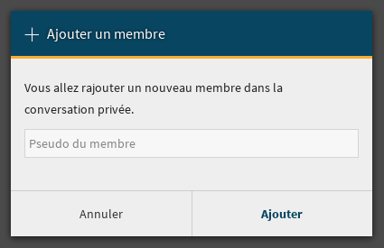
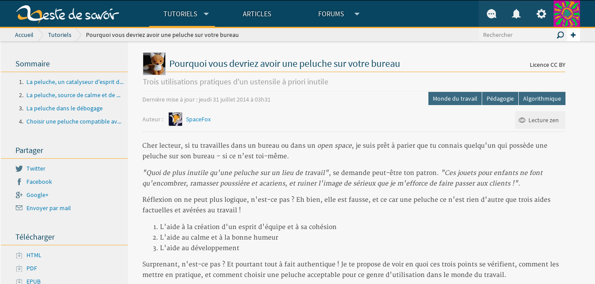
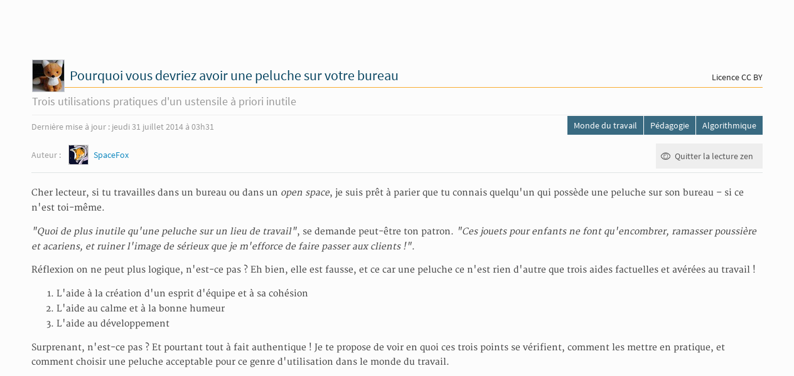
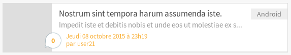
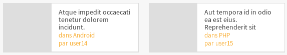
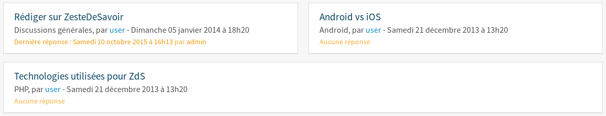
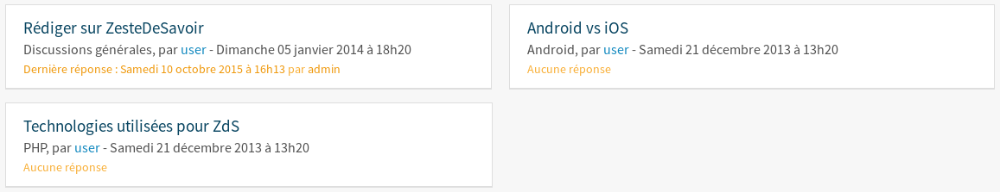

============================
Eléments spécifiques au site
============================

Les boîtes modales
==================

Une boîte modale est une pseudo-fenêtre qui s'affiche au clique de certains boutons. Elle a pour but de faire confirmer un choix à l'utilisateur ou de permettre à celui-ci de remplir un formulaire.

   La boîte modale pour ajouter un participant à un message privé

Une boîte modale est un élément HTML avec la classe CSS ``modal``. Mais ce ne serait pas drôle s'il n'y avait pas des
spécificités suivant les cas d'utilisation !

Cas courant : quand c'est un formulaire
---------------------------------------

On utilise souvent les boîtes modales avec un formulaire que ce soit pour confirmer une action (par exemple,
une suppression) ou pour demander à l'utilisateur de remplir des champs de texte (par exemple, ajout de nouveaux
participants à une discussion ou nouveaux auteurs à un tutoriel) !

Il arrive souvent d'avoir donc ceci :

.. sourcecode:: html

   <form action="{{ url }}" method="post" id="une-ancre" class="modal modal-flex">
       Voici un formulaire !

       <textarea>Voici un champ de texte...</textarea>

       <input type="submit">Voici un bouton</input>
   </form>

On a ici un bouton pour envoyer le formulaire. Mais comment l'utilisateur ferme la boîte modale ?
Il peut cliquer en-dehors de la boîte ou bien presser la touche "Échape", mais il y a plus simple.
En effet, un bouton "Annuler" est automatiquement ajouté pour que l'utilisateur puisse fermer la
boîte modale très simplement !

Cas particulier : quand ce n'est pas un formulaire
--------------------------------------------------

On peut se dire qu'avec ce code tout va bien fonctionner :

.. sourcecode:: html

   

       Une super boîte modale !
   

Malheureusement, non : le bouton de fermeture ne prend que la moitié de la place ! Ce problème se résout
très rapidement en ajoutant l'attribut ``data-modal-close="Fermez-moi !"`` à le boîte modale. Le texte
de l'attribut (ici ``Fermez-moi !``) deviendra le texte du bouton.

.. sourcecode:: html

   

       Une super boîte modale !
   

Créer le lien
-------------

La création du lien affichant la boîte modale est tout aussi simple : il suffit de mettre une ancre correspondant à l'``id`` de la boîte modale ainsi que la classe ``open-modal`` :

.. sourcecode:: html

   <a href="#une-ancre" class="open-modal">
       Un super lien !
   </a>

.. Attention::

   Attention, le texte du lien sera le titre de la boîte modale.

Les tailles des modales
-----------------------

Par défaut, les modales vont prendre tout l'écran en largeur, mais en ajoutant une classe ``modal-flex``, la modale va prendre la taille du contenu, avec comme taille minimum 400px. La modale va automatiquement s'adapter en hauteur et en largeur. Si une modale prend quand même toute la taille en largeur, c'est sûrement que le contenu de votre modale a une taille à 100% !

API Javascript pour manipuler les modales
-----------------------------------------

Il est possible de créer des modales en Javascript. Exemple:

.. sourcecode:: javascript

  var m = new Modal({
      title: "Titre de la modale",
      body: "
Contenu de la modale
", // Peut être un DOMNode ou un objet jQuery
      footer: $("<a>", { href: "#", class: "btn btn-submit", text: "Valider" }), // Bouton dans le footer, en plus du bouton annuler
      closeText: "Fermez-moi !", // Texte du bouton pour fermer. "Annuler" par défaut
      titleIcon: "light alert", // Ajoute une icone au titre de la modale
      modal: $("<form>", { action: "/submit", class: "modal modal-flex" }); // Node qui deviendra la modale. Peut-être un formulaire.
  });

  m.open(); // Ouvre la modale
  m.close(); // Ferme la modale
  Modal.current; // Contient la modale courante (utile pour savoir si une modale est ouverte)
  Modal.closeCurrent(); // Ferme la modale courante

La lecture zen
==============

La lecture zen est un mode d'affichage des tutoriels et des articles permettant à l'utilisateur de se concentrer sur sa lecture.
Elle cache l'en-tête et la barre latérale de la page pour ne laisser que le contenu principal.

   Un tutoriel sans lecture zen

   Ce même tutoriel avec lecture zen

Pour avoir la lecture zen, il suffit d'inclure le bouton "Lecture zen" là où vous voulez :

.. sourcecode:: html

   

Au clic du bouton, le Javascript se chargera de mettre ou d'enlever la classe ``zen-mode`` à ``.content-container``.

Les *items* représentant les contenus et les derniers sujets
============================================================

Les contenus (articles et tutoriels) ainsi que les derniers sujets de la page d'accueil sont représentés dans des *items*.

   En voici un exemple

Importation dans un gabarit
---------------------------

Article
~~~~~~~

.. sourcecode:: html

   

Vous pouvez passer trois arguments aux fichiers :

- ``public_article`` (ou ``article`` s'il n'est pas publié) : un objet de type ``PublishableContent``. **Obligatoire**
- ``show_description`` : un booléen pour afficher ou non la description de l'article. *Est à False par défaut.*
- ``type`` : doit avoir pour valeur ``"beta"`` pour afficher la version béta. *Est vide par défaut.*

Par exemple, pour afficher un article publié avec sa description :

.. sourcecode:: html

   

Ou sinon, pour afficher un article en béta sans description :

.. sourcecode:: html

   

Tutoriel
~~~~~~~~

.. sourcecode:: html

   

Vous pouvez passer quatre arguments aux fichiers :

- ``public_tutorial`` (ou ``tutorial`` s'il n'est pas publié) : un objet de type ``PublishableContent``. **Obligatoire**
- ``show_description`` : un booléen pour afficher ou non la description du tutoriel. *Est par défaut à False.*
- ``type`` : doit avoir pour valeur ``"beta"`` pour afficher la version béta. *Est vide par défaut.*
- ``item_class`` : ajoute des classes au tutoriel (par exemple, la classe "mini" pour afficher le tutoriel en plus petit). *Est vide par défaut.*

Par exemple, pour afficher un tutoriel publié avec sa description :

.. sourcecode:: html

   

Ou sinon, pour afficher un tutoriel en béta sans description et en taille réduite :

.. sourcecode:: html

   

   Voici deux tutoriels en taille réduite

Sujet
~~~~~

.. sourcecode:: html

   

Vous devez passer en argument ``topic`` qui est un objet de type ``Topic``.

Faire une liste d'*items*
-------------------------

Si vous voulez faire une liste de tutoriels, il faut les regrouper dans une ``

``.

.. sourcecode:: html

   

       <!-- Mes tutoriels -->
   

Ils sont répartis une ou des colonnes (une seule sur mobile jusqu'à quatre sur un écran haute définition).

Malheureusement, si les tutoriels sont affichés sur deux colonnes et qu'ils sont en nombre impair, le dernier tutoriel va prendre la même place que deux. Un exemple vaut mille mots :

.. sourcecode:: bash

   |   Tutoriel   | |   Tutoriel   |
   |           Tutoriel            |

   Voici trois tutoriels sur deux colonnes avec le problème

Pour y remédier, il faut toujours mettre à la fin de votre liste d'articles trois ``

``. Cela donne au final ceci :

.. sourcecode:: html

   

       <!-- Mes tutoriels -->
       

       

       

   

   Voici trois tutoriels sur deux colonnes sans le problème

(Pour l'explication technique, c'est dû à l'utilisation de *flexbox*.)

Ajouter un design temporaire
============================

Il y a dans le fichier ``settings.py`` un tableau ``ZDS_APP.visual_changes``. Ce tableau de chaînes de caractères est injecté sous forme de classes au body, avec comme prefixe ``vc-`` (si l'utilisateur n'as pas bloqué les designs temporaires dans ses paramètres).

Il suffit donc, dans le style et dans les scripts si le ``body`` a la classe ``vc-{...}`` correspondante au changement visuel.

.. sourcecode:: scss

    .element {
        color: #FFF;
        body.vc-clem-christmas & { // Donnera donc body.vc-clem-christmas .element
          color #F00;
        }
    }

.. sourcecode:: javascript

    if($("body").hasClass("vc-snow")) {
        // ...
    }

Changements visuels disponibles
-------------------------------

Les changements visuels disponibles sont:

  - ``snow``: ajoute de la neige dans le header
  - ``clem-christmas``: ajoute un bonnet à la Clem de la page d'accueil

Par exemple, pour activer les changements ``snow`` et ``clem-christmas``, il faut ajouter au ``settings_prod.py``:

.. sourcecode:: python

    ZDS_APP['visual_changes'] = ['snow', 'clem-christmas']

