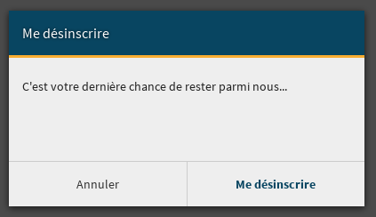

============================
Eléments spécifiques au site
============================

Les boîtes modales
==================

Une boîte modale est une pseudo-fenêtre qui s'affiche au clique de certains boutons. Elle a pour but de faire confirmer un choix à l'utilisateur ou de permettre à celui-ci de remplir un formulaire.

.. figure:: ../images/design/boite-modale_mp.png
   :align: center

   La boîte modale pour ajouter un participant à un message privé

   La boîte modale pour confirmer sa désinscription

La lecture zen
==============

La lecture zen est un mode d'affichage des tutoriels et des articles permettant à l'utilisateur de se concentrer sur sa lecture. Elle cache l'en-tête et la barre latérale de la page pour ne laisser que le contenu principal. Techniquement, c'est un mélange de Javascript et de (S)CSS.

.. figure:: ../images/design/lecture-zen_off.png
   :align: center

   Un tutoriel sans lecture zen

.. figure:: ../images/design/lecture-zen_on.png
   :align: center

   Ce même tutoriel avec lecture zen

