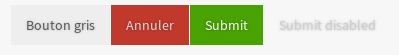
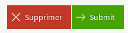
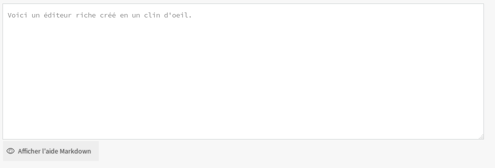

=====================
Interface utilisateur
=====================

Icônes
======

Insérer une icône
-----------------

L'élément que vous souhaitez imager (un bouton, un lien de la barre latérale, etc.) avec les classes indiquées dans la liste ci-dessous vous permettront d'avoir une icône.
Toutes les icônes nécessitent la présence de la classe ``ico-after``.
Elle sera mise en place de façon différente selon l'endroit où vous l'insérez.

.. sourcecode:: html+django

  <button class="ico-after btn-cancel cross light">
      Bouton de suppression
  </button>

Ou :

.. sourcecode:: html+django

  

Boutons
=======

Base
----

Les boutons peuvent être construits à partir de la balise ``<button>`` ou ``<a>`` selon les besoins. Si le lien ne pointe vers aucune page, préférez utiliser button qui est sémantiquement plus correct.

Les boutons sont alignés à droite car uniquement utilisés pour les formulaires ou assimilés. Il sont en flottant, ce qui permet de les "empiler" de côté, ce qu'on retrouve sous les formulaires de soumission avec "Aperçu" et "Envoyer".

Tous les boutons doivent avoir la classe btn associé à la couleur que l'on souhaite, ici on choisira gris donc ``btn-grey``.

Exemple :

.. sourcecode:: html+django

  <a href="#" class="btn btn-grey">Ceci est un lien</a>
  <button class="btn btn-grey">Ceci est un bouton</button>

Couleurs
--------

Les couleurs disponibles sont :

-  gris : ``btn-grey``
-  rouge : ``btn-cancel``
-  les boutons de type ``submit`` n'ont besoin d'aucune classe (pas même ``btn``) et seront verts ; si une couleur est appliquée, elle sera prioritaire sur le vert
-  les boutons ``disabled`` ont un fond et un texte plus clair.

Icône
-----

Ajoutez une icône sur un bouton comme sur n'importe quel autre élément :

.. sourcecode:: html+django

  <button type="submit" class="ico-after arrow-right light">Submit</button>
  <button type="submit" class="btn-cancel ico-after cross light">Supprimer</button>

Le style général du site se veut épuré, on évitera les icônes sur les boutons de soumission de formulaire. On les utilisera pour illustrer les boutons d'action : déplacer, supprimer, renommer, éditer, etc.

Icône d'aide
------------

Il existe une classe, ``help-question-mark``, à appliquer sur un lien, affichant
un petit cercle coloré autour du texte du lien. Avec ``?`` comme texte de lien,
cela permet d'afficher un petit point d'interrogation cerclé, idéal pour une
petite icône ouvrant une aide.

N'oubliez pas d'ajouter un attribut ``title`` (ou si l'infobulle gêne,
``aria-label``), pour l'accessibilité du lien.

.. sourcecode:: html+django

  <a href="#" class="help-question-mark" title="Titre du lien">?</a>

Bouton de modification
----------------------

Pour afficher un petit bouton permettant de modifier un élément, et *seulement si
l'élément modifié est clairement identifié pour l'utilisateur*, il existe une
classe ``edit-button`` à ajouter à un lien. Le texte de ce lien doit être masqué
afin de ne pas briser son affichage. Le rendu sera un crayon bleu, virant au blanc
sur fond bleu circulaire lorsque survolé.

Il est important de tout de même spécifier *et* un texte dans le bouton (masqué),
*et* une infobulle, afin d'être très clair sur le rôle du bouton tant pour un
utilisateur normal (le bouton n'ayant pas de nom visuel, l'infobulle permet de
confirmer ce qu'il fait) que pour un utilisateur usant d'un lecteur d'écran (le
texte alternatif étant alors indispensable, l'icône crayon ne pouvant être vue).

Aussi, si le lien ouvre une boîte modale, celle-ci sera sans titre si le lien est
vide.

Voici un exemple.

.. sourcecode:: html+django

  <a href="#modal" class="open-modal edit-button" title="">
    
  </a>

Pour s'assurer que le bouton de modification et ce qu'il permet de modifier
soient correctement alignés verticalement et espacés, il existe une seconde
classe à appliquer à un conteneur des deux éléments : ``editable-element``.

Cet élément doit avoir deux enfants : l'un d'entre eux sera l'élément
visuellement modifié, et l'autre le bouton de modification, avec la classe
``edit-button``. S'il a plus de deux enfants, le bouton de modification prendra
toujours le moins d'espace possible, et les autres se partageront équitablement
la place disponible, tout en restant alignés verticalement.

Le bouton peut être placé avant ou après l'élément : l'alignement et
l'espacement seront correctement gérés.

Si on prend l'exemple d'une licence d'un contenu à côté de laquelle on place un
bouton de modification, l'on pourrait utiliser le code HTML suivant.

.. sourcecode:: html+django

  

    
{{ content.licence }}

    <a href="#edit-license" class="open-modal edit-button" title="Modifier la licence">
      Modifier la licence
    </a>
  

Formulaires
===========

Assistant d'édition Markdown
----------------------------

Sur n'importe quel ``textarea``, ajoutez la classe ``md-editor`` et il se passera alors :

-  transformation du champ en éditeur riche (boutons d'assistance à l'édition, ...) ;
-  ajout de l'aide Markdown en dessous du formulaire.

Démonstration :

Boites modales
==============

Les bases
---------

Les boîtes modales sont à utiliser pour les confirmations (formulaire), informations complémentaires (lecture seule) ou encore pour des actions secondaires (pagination, etc.).

Un lien, généralement sous la forme d'un bouton, ayant comme ``href`` l'``id`` de la modale associée. Le titre et l'icône de la modale sont issues du lien qui ouvre la modale, la dernière partie de cette page détail comment en changer.

Une boite modale et son lien associés peuvent être n'importe où dans la page, le système se base sur un ``id`` qui est par définition unique.

.. sourcecode:: html+django

  <a href="#doc-modal" class="open-modal">Ce lien ouvre une boite modale</a>
  <form class="modal modal-small" id="doc-modal" action="">
      

          Voici le contenu de la modale.
      

      

          Le formulaire ne fonctionne pas ici, cliquez donc sur **Annuler** pour fermer.
      

      <button type="submit">Envoyer</button>
  </form>

Tailles des modales
-------------------

Par défaut, la modale prendra toute la page.

Il y a 3 classes pour 3 dimensions qui changent la hauteur de celle-ci :

-  Sans rien, par défaut
-  ``modal-small``
-  ``modal-medium``
-  ``modal-big``

Informations supplémentatires
-----------------------------

Si le lien a une icône, la modale la rajoutera automatiquement.

.. sourcecode:: html+django

  <a href="#doc-modal-ico" class="open-modal btn btn-grey ico-after view blue">Exemple avec icône</a>
  <form class="modal modal-small" id="doc-modal-ico" action="">
      

          La modale a une icône devant le titre.
      

      <button type="submit">Me désinscrire</button>
  </form>

Lecture seule
-------------

Dans certains cas, les modales ne sont pas des formulaires mais simplement des boites d'affichage en lecture seule. Il est alors possible de préciser le texte du bouton de fermeture au travers de l'attribut ``data-modal-close``.

.. sourcecode:: html+django

  <a href="#doc-modal-close" class="open-modal">Ce lien ouvre une boite modale</a>
  

      

          Que du texte, rien à faire d'autre.
      

  

Messages flash
==============

Un message dit "flash" est un message d'information ou d'alerte qui est masquable selon la volonté de l'utilisateur et qui disparaîtra généralement à la page suivante (comportement selon le back-end).

Utilisation de base
-------------------

Le texte placé dans le bouton de fermeture est présent pour des raisons d'accessibilité. Il n'est pas visible par défaut.

Il y a trois couleurs :

-  rouge, pour les erreurs ``alert-box error``
-  orange, pour les alertes/avertissements ``alert-box warning``
-  vert, pour les succès/confirmations ``alert-box success``

.. sourcecode:: html+django

  <!-- Changez simplement la classe "success" pour une autre pour changer le fond -->
  

      Votre message ici.
      <button class="close-alert-box ico-after cross white">Masquer l'alerte</button>
  

Modulation
----------

Il est possible de forcer l'affichage du texte à la place ou en plus de la croix en rajoutant la classe ``close-alert-box-text`` au bouton de fermeture.

.. sourcecode:: html+django

  

      Pas d'icône, juste du texte.
      <button class="close-alert-box close-alert-box-text">Masquer l'alerte</button>
  

Vous pouvez combiner icône et texte comme ceci :

.. sourcecode:: html+django

  

      Croix + texte.
      <button class="close-alert-box close-alert-box-text ico-after cross white">Masquer l'alerte</button>
  

