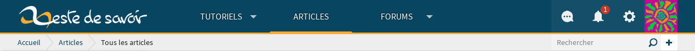
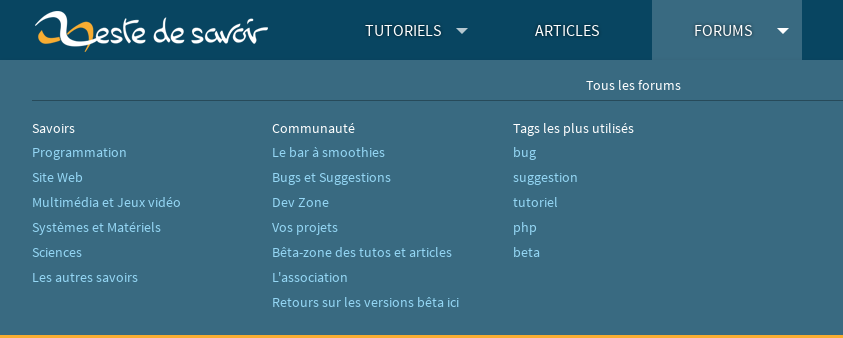
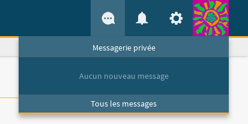
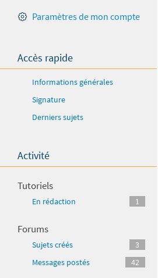
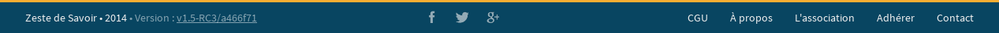
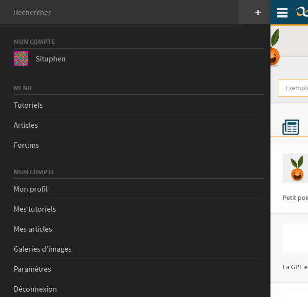

=========================
Structure globale du site
=========================

Le site est composé de plusieurs grandes parties.

Tous ces éléments sont dans le fichier ``templates/base.html``. Pour les utiliser dans les gabarits, il suffit
d'étendre ``base.html``, avec cette ligne :

.. sourcecode:: html

   

Quand il s'agit d'un contenu comme un tutoriel ou un article, il faut étendre ``templates/base_content_page.html`` :

.. sourcecode:: html

   

Il se peut aussi que les modules aient leur propre gabarit de base, auquel cas c'est ce dernier qu'il faut utiliser :

.. sourcecode:: html

   

.. seealso::
   Pour en savoir plus, n'hésitez pas à la partie de la documentation de Django sur
   `l'héritage des gabarits <https://docs.djangoproject.com/fr/1.8/topics/templates/#template-inheritance>`_ !

L'en-tête
=========

On peut découper l'en-tête du site en quatre.

Le logo
-------

Le logo est simplement un lien qui a pour contenu une image. L'image change en fonction de la taille de l'écran.

Le menu
-------

Le menu est composé soit d'un lien, soit d'un menu déroulant. Ces derniers contiennent des listes de liens.

La *logbox*
-----------

Pour un utilisateur connecté
~~~~~~~~~~~~~~~~~~~~~~~~~~~~

Pour un utilisateur connecté, la *logbox* contient trois menus déroulants :

- le premier affiche les messages privés ;
- le deuxième affiche les notifications ;
- et le dernier contient des liens vers les zones réservées à l'utilisateur.

Pour le Staff (les membres avec les droits de modération), il existe un autre menu pour les alertes de modération.

Pour un anonyme
~~~~~~~~~~~~~~~

Pour un anonyme, il y a simplement deux boutons :

- un pour se connecter ;
- un pour s'inscrire.

Le sous en-tête
---------------

Le sous-entête est en deux partie :

- à gauche, une aide à la navigation ;
- à droite, un petit formulaire de recherche.

L'aide à la navigation
~~~~~~~~~~~~~~~~~~~~~~

Pour renseigner l'aide à la navigation, il faut utiliser le bloc ```` :

.. sourcecode:: html

   <li>Le titre de ma page</li>

Quand il s'agit d'un gabarit de base, comme ``templates/module/base.html``, il faut utiliser
```` :

.. sourcecode:: html

   
       <li>
           <a href="">
               Le titre de mon module
           </a>
       </li>
   

Le contenu principal
====================

Le contenu principal change radicalement suivant les pages : tutoriels, articles, messages du forum, messages privés...
Il y a donc différentes façons de l'afficher suivant le contenu ! Dans les gabarits, le résultat est donc l'existence
de plusieurs blocs différents.

Du contenu accompagné de titre et sous-titre
--------------------------------------------

Il faut mettre le contenu entre ```` et ````, comme ceci :

.. sourcecode:: html

   

   
       

           Super contenu !
       

   

Vous avez deux autres blocs, le premier pour le titre et le deuxième pour le sous-titre :

.. sourcecode:: html

   

   
       Mon super titre !
   

   
       Avec mon tout aussi superbe sous-titre...
   

   
       

           Toujours avec mon super contenu !
       

   

Du contenu sans titre ni sous-titre
-----------------------------------

Dans ce cas là, il faut simplement utiliser ```` :

.. sourcecode:: html

   

   
       

           Super contenu sans titre ni sous-titre !
       

   

Du contenu comme un tutoriel ou un article
------------------------------------------

Dans ce cas là, il faut utiliser ```` mais avec ```` :

.. sourcecode:: html

   

   
       C'est un article !
   

   
       A moins que ce soit un tutoriel...
   

   
       

           Bref, il y a encore et encore du contenu !
       

   

Il peut arriver de devoir afficher d'autres types de contenus, comme des commentaires, en bas de la page. Dans ce
cas là, on peut utiliser ```` en plus :

.. sourcecode:: html

   

   
       

           Bref, il y a encore, encore et encore du contenu !
       

   

   
       

           Et là, paf, un autre type de contenu.
       

   

Il existe une alternative à ```` qui s'utilise de la même manière : ````.
La différence est minime, pour plus d'informations, regardez le fichier ``templates/base_content_page.html``.

La barre latérale
=================

La barre latérale contient des listes de liens, boutons ou formulaires permettant à l'utilisateur d'effectuer des actions.

   Barre latérale de la page d'un profil

Pour la barre latérale, il faut étendre ``templates/base.html`` et utiliser ```` :

.. sourcecode:: html

   

   
       Ma superbe barre latérale !
   

Pour les pages comme un tutoriel ou un article
----------------------------------------------

Il faut étendre ``templates/base_content_page.html`` et utiliser ```` :

.. sourcecode:: html

   

   
       La superbe barre latérale des articles ou tutoriels !
   

Tout comme les modules peuvent avoir leur propre gabarit de base, il peuvent avoir leur propre bloc pour la barre latérale :

.. sourcecode:: html

   

   
       La superbe barre latérale de mon module !
   

Pour trouver le nom de ce bloc, regardez ``templates/module/base.html`` !

Le bas de page
==============

Le bas de page est sûrement la partie la plus simple du site. Il contient trois *flexboxs* [#flexbox]_ :

- celui de gauche affiche le nom du site ;
- celui du milieu contient les liens vers les comptes des réseaux sociaux du site ;
- celui de droite contient des liens vers les pages annexes du site, tel que les CGUs par exemple.

.. [#flexbox] modèle de boîte flexible en HTML/CSS (`voir le tutoriel sur Alsacréations <http://www.alsacreations.com/tuto/lire/1493-css3-flexbox-layout-module.html>`_)

Le menu pour mobile
===================

Le menu pour mobile est généré à partir de l'en-tête et de la barre latérale grâce à `ce code Javascript <https://github.com/zestedesavoir/zds-site/blob/dev/assets/js/mobile-menu.js>`_.

Design fluide (responsive design)
=================================

Le design est prévu dès le début pour être adapté à un maximum de supports (à priori tous). Ainsi, il faudra prendre garde à quelques détails si l'on souhaite un comportement idéal sur tablettes et mobiles.

Une différence notable sur les petits appareils est que la barre de navigation latérale gauche est masquée par défaut. Elle est disponible au glissé (swipe) du bord gauche vers la droite, ou directement via l'icône en haut.

.. note::
    Sur les anciens navigateurs mobiles (navigateur natif Android), ce menu n'est pas mis en place au profit de liens directement visibles mais de fait plus encombrants. Le soucis vient de l'impossibilité de gérer correctement le menu latéral. Le menu latéral est alors placé tout en bas de la page sur ces navigateurs.

Cette barre latérale sera à soigner, sa structure HTML est relativement complexe principalement au niveau des attributs et classes à placer pour obtenir le comportement souhaité.

Le site est codé selon la pratique mobile first, c'est à dire que le design est prévu pour les mobiles en premier : dans le code le style par défaut est celui destiné aux mobiles. Des feuilles de styles avec media-queries viendront par la suite surcharger les propriétés pour les appareils plus grands.
