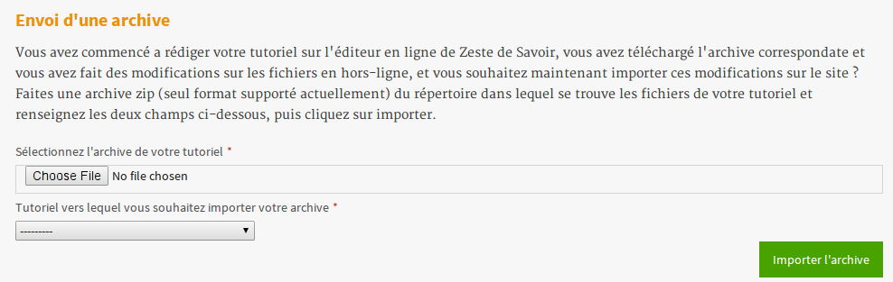
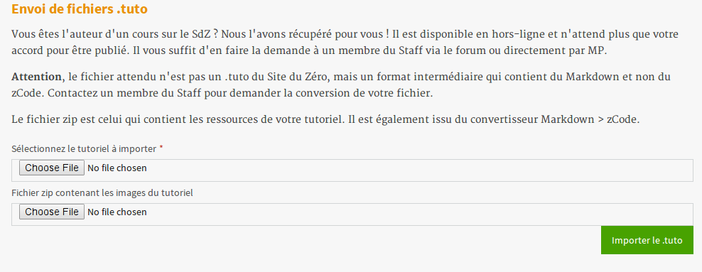

=============
Les tutoriels
=============

Les composantes d'un tutoriel
=============================

Un tutoriel n'est qu'un ensemble d'introduction, de corps et de conclusion.
Cependant, selon la taille souhaitée du tutoriel, il peut nécessiter une organisation
particulière. C'est pourquoi les tutoriels de ZdS sont structurés en **quatre** niveaux.

Niveau 1 : Le tutoriel
----------------------

Ce niveau définit l'ensemble des métadonnées associées à un tutoriel, c'est le plus haut
niveau de tous les tutoriels. On y retrouve les informations suivantes :

- titre
- description
- logo
- licence
- sous-catégories
- introduction
- conclusion

Niveau 2 : La partie
--------------------

Ce niveau adapté à des documents un peu plus longs, permet de subdiviser notre contenu
en plusieurs parties. C'est typiquement le niveau qui sera utile si vous souhaitez rédiger
un mémoire, ou une thèse. Par contre, pour un simple article, ce n'est pas la peine d'en faire
des parties. Un tutoriel peut contenir plusieurs parties et une partie comprend essentiellement
les informations suivantes :

- titre
- introduction
- conclusion
- position (dans le tutoriel)

Niveau 3 : Le chapitre
----------------------

On retrouve là encore les mêmes notions qu'on peut rencontrer dans la rédaction d'un document
pédagogique. Si une partie peut contenir plusieurs chapitres (on le verra plus loin dans le cas
des bigtutos), un chapitre peut être rattaché à un tutoriel directement (minituto).
Le chapitre comprend les informations suivantes :

- titre
- introduction
- conclusion

Niveau 4 : L'extrait
--------------------

L'extrait est le niveau le plus fin de subdivision d'un tutoriel. Il constitue le contenu, ou encore
le corps de notre texte. Un extrait est constitué uniquement d'un bloc de texte.

Les types de tutoriels
======================

Il existe actuellement deux types de tutoriels, les minitutos et les bigtutos,
Même s'il y a une réflexion sur la création de moyen-tutos, laissez moi déjà
vous présenter ce qui existe aujourd'hui.

Les minitutos
-------------

Un minituto est un format de tutoriel pour du contenu léger. Fonctionnellement il s'agit d'un tutoriel
qui ne contient qu'un seul chapitre (niveau 3) mais peut contenir un ou plusieurs extraits.
On pourrait le représenter ainsi :

.. sourcecode:: none

 Tutoriels  -> chapitre  -
                         |-> introduction
                         |->
                         |-> extrait 1
                         |-> extrait 2
                         |-> extrait ...
                         |-> extrait n
                         |->
                         |-> conclusion

Dans ce cas, le nombre de chapitre est bien limité à 1 et la présentation d'un minituto consiste à
présenter un seul chapitre de la structure globale.

Les bigtutos
------------

Un bigtuto, si on repense à nos niveaux de structure, est un tutoriel dans lequel on peut avoir plusieurs
parties, chaque partie pouvant contenir plusieurs chapitres et chaque chapitre pouvant à leur tour
contenir plusieurs extraits.
Les bigtutos reprennent donc ici tous les éléments de la structure. Ce format est adapté aux tutoriels
dont le contenu est assez conséquent, et demandent beaucoup de structuration. On pourrait le représenter ainsi :

.. sourcecode:: none

  Tutoriels -
            -> partie 1 -
                          |-> chapitre 1 -
                                         |-> introduction
                                         |-> extrait 1
                                         |-> extrait 2
                                         |-> extrait ...
                                         |-> extrait n
                                         |-> conclusion
                          |-> chapitre 2 -
                                         |-> introduction
                                         |-> extrait 1
                                         |-> extrait 2
                                         |-> extrait ...
                                         |-> extrait n
                                         |-> conclusion
                          |-> chapitre n -
                                         |-> introduction
                                         |-> extrait 1
                                         |-> extrait 2
                                         |-> extrait ...
                                         |-> extrait n
                                         |-> conclusion
            -> partie 2 -
                          |-> chapitre 1 -
                                         |-> introduction
                                         |-> extrait 1
                                         |-> extrait 2
                                         |-> extrait ...
                                         |-> extrait n
                                         |-> conclusion
                          |-> chapitre 2 -
                                         |-> introduction
                                         |-> extrait 1
                                         |-> extrait 2
                                         |-> extrait ...
                                         |-> extrait n
                                         |-> conclusion
                          |-> chapitre n -
                                         |-> introduction
                                         |-> extrait 1
                                         |-> extrait 2
                                         |-> extrait ...
                                         |-> extrait n
                                         |-> conclusion
            -> partie n -
                          |-> chapitre 1 -
                                         |-> introduction
                                         |-> extrait 1
                                         |-> extrait 2
                                         |-> extrait ...
                                         |-> extrait n
                                         |-> conclusion
                          |-> chapitre 2 -
                                         |-> introduction
                                         |-> extrait 1
                                         |-> extrait 2
                                         |-> extrait ...
                                         |-> extrait n
                                         |-> conclusion
                          |-> chapitre n -
                                         |-> introduction
                                         |-> extrait 1
                                         |-> extrait 2
                                         |-> extrait ...
                                         |-> extrait n
                                         |-> conclusion

Import de tutoriels
===================

Zeste de Savoir permet d'importer des tutoriels provenant de sources extérieures. Deux formats d'import sont actuellement supportés.

Les archives zip
----------------

Si vous avez commencé a rédiger un tutoriel via l'éditeur en ligne de Zeste de Savoir, vous avez téléchargé l'archive correspondante et vous avez fait des modifications sur les fichiers en hors-ligne, et vous souhaitez maintenant importer ces modifications sur le site. Il suffit de faire une archive zip du répertoire dans lequel se trouvent les fichiers de votre tutoriel et de renseigner les deux champs relatifs à l'import d'une archive, puis de cliquer sur importer.

.. attention::

    Le rajout d'une partie, d'un chapitre ou d'un tutoriel n'est pas encore supporté dans l'import. Le module n'importera que ce qui a été **modifié** dans les fichiers markdown.

Le format .tuto
---------------

Il s'agit du format dans lequel étaient exportés les tutoriels sur le Site du Zéro. C'est un format de type xml. Cependant, pour qu'il soit
importable sur ZdS il faut le transformer à l'aide d'un outil de conversion en semi-markdown. Si vous avez besoin d'importer un tutoriel
de ce format, vous devez contacter le staff de Zeste de Savoir pour que votre fichier ``.tuto`` soit converti en semi markdown.

Vous aurez aussi besoin du pack d'images (au format zip) qui sont utilisés dans votre tutoriel.

Il ne vous restera plus qu'à renseigner les champs relatifs à l'import de ``.tuto`` pour importer le vôtre.

.. attention::

    L'import du tutoriel peut prendre beaucoup de temps en fonction de la taille de votre tutoriel.

Cycle de vie des tutoriels
==========================

Quelque soit le type de tutoriel, le cycle de vie de celui-ci reste toujours le même.
Un tutoriel peut être rédigé par un ou plusieurs auteurs. Chaque modification sur le tutoriel
est conservée afin de pouvoir retrouver l'historique des modifications et éventuellement
récupérer le contenu perdu. Lorsqu'un tutoriel est créé il rentre dans sa première étape.

Le brouillon
------------

Le brouillon est la première étape du cycle de vie d'un tutoriel. Il donne toujours l'état
le plus récent du contenu d'un tutoriel vu par les auteurs. Chaque fois que le contenu du
tutoriel est modifié, c'est la version brouillon qui est mise à jour.
La version brouillon est accessible uniquement pour les auteurs et validateurs d'un tutoriel.
Si on souhaite donner un accès en lecture seule à nos écrits, il faut passer par la méthode
adéquate.

La bêta
-------

Lorsque les auteurs estiment que leur tutoriel est arrivé à un certain niveau de maturité, et qu'ils souhaitent
recueillir les premiers retours de lecteurs, ils se doivent de mettre à disposition de la communauté le tutoriel en
lecture seule. C'est le mode bêta.

La procédure voudrait que lors de l'ouverture d'une bêta, l'auteur crée un sujet dans le forum des tutoriels
en bêta, en postant le lien vers la version bêta du tutoriel.

.. attention::

    Le lien de la bêta, peut être trouvé via votre profil utilisateur, vous devez recopier tout le lien avec la partie ``?version=blablabla``. Et pensez bien à modifier ce lien lorsque vous mettez à jour votre version bêta.

En fait lorsqu'un tutoriel est en mode bêta, il s'agit d'une version précise qui est mise
dans ce mode. On peut continuer à mettre à jour la version brouillon pour rajouter de nouveaux chapitres
à notre tutoriel, pendant ce temps, la communauté lit une version figée de notre tutoriel. L'avantage étant que
si le tutoriel prend beaucoup de temps à lire, le lecteur n'a pas de mauvaise surprise de mise à jour
pendant sa lecture. Les auteurs quant à eux doivent mettre à jour manuellement leur version bêta et ainsi
ils contrôlent pleinement ce qu'ils mettent à disposition des lecteurs.

La validation
-------------

Une fois que l'auteur a eu assez de retour sur son tutoriel, et qu'il estime qu'il est prêt à être publié,
il décide d'envoyer son tutoriel en validation.

L'envoi en validation n'est pas définitif, dans le sens où, vous pouvez à tout moment mettre à jour la version
qui se trouve du coté des validateurs. Évitez d'en abuser tout de même, car, si un validateur commence à lire
votre tutoriel, il devra recommencer son travail si vous faites une mise à jour dessus. Ce qui pourrait non seulement
ralentir le processus de validation de votre tutoriel, mais décourager aussi le validateur. Donc un conseil à donner serait
de n'envoyer que du contenu sûr en validation.

Comme pour la bêta, la version brouillon du tutoriel peut continuer à être améliorée pendant que la version
de validation reste figée. Auteurs et validateurs peuvent donc continuer à travailler chacun de son côté.

La publication
--------------

Une fois le contenu, lu et relu par l'équipe staff, le tutoriel est publié. Il faut bien préciser que le processus
de validation peut être assez long en fonction de la taille du tutoriel traité. Un tutoriel n'est pas obligé
d'être publié à la suite d'une demande de validation, il peut aussi être rejeté. Dans tous les cas, un historique
de validation est disponible pour les membres du staff.

La publication d'un tutoriel entraîne la création d'export en plusieurs formats. On a les formats

- Markdown : disponible uniquement pour les membres du staff et les auteurs des tutoriels
- HTML
- PDF
- EPUB : format de lecture adapté aux liseuses
- Archive : un export de l'archive contenant le dépôt git du projet.

Pour différentes raisons, il se peut que l'export dans divers formats échoue. Dans ce cas, le lien de téléchargement n'est pas présenté. Un fichier de log sur le serveur enregistre les problèmes liés à l'export d'un format.

Aujourd'hui il existe des bugs dans la conversion en PDF (blocs custom), qui devront être réglés plus tard avec la `ZEP 05 <http://zestedesavoir.com/forums/sujet/676/zep-05-refonte-du-traitement-markdown-pour-lexport>`_)

L'entraide
----------

Afin d'aider les auteurs de tutoriels à rédiger ces derniers, des options lors de la création/édition de ce dernier sont disponibles. L'auteur peut ainsi faire aisément une demande d'aide pour les compétences suivantes (liste non exhaustive) :

- Besoin d'aide à l'écriture
- Besoin d'aide à la correction/relecture
- Besoin d'aide pour illustrer
- Désir d'abandonner le tutoriel et recherche d'un repreneur

L'ensemble des tutoriels à la recherche d'aide est visible via la page "/tutoriels/aides/". Cette page génère un tableau récapitulatif de toutes les demandes d'aides pour les différents tutoriels et des filtres peuvent être appliqués.

Il est également possible **pour tout membre qui n'est pas auteur du tutoriel consulté** de signaler une erreur, en employant le bouton prévu à cet effet et situé en bas d'une page du tutoriel (il est également présent en bas d'un chapitre, s'il s'agit d'un big-tutoriel).

   .. figure:: images/warn-typo-button.png
      :align: center

      Bouton permentant de signaler une erreur

Ce bouton est disponible sur la version publiée ou en bêta d'un tutoriel. Cliquer sur celui-ci ouvre une boite de dialogue :

   .. figure:: images/warn-typo-dial.png
      :align: center

      Boite de dialogue permetant de signaler à l'auteur une erreur qu'il aurait commise

Le message ne peut pas être vide, mais n'hésitez pas à être précis et a donner des détails. Cliquer sur "Envoyer" envera un message privé aux auteurs du tutoriels, reprenant votre message. Vous participerez également à la conversation, afin que les auteurs puissent vous demander plus de détails le cas échéant.

L'aspect technique
==================

Le stockage dans la base de données
-----------------------------------

Aujourd'hui la base de données est utilisée comme zone tampon, surtout parce que Django propose déjà des méthodes
d'enregistrement des objets en base de données de manière concurrentes et *thread safe*. L'idée étant de s'en
détacher à terme.
La version stockée dans la base de données est le dernier état, c'est-à-dire l'état de la version en
brouillon. Il ne faut donc pas aller chercher en base de données les informations pour les afficher.

Chaque tutoriel possède trois attributs principaux :

- sha_draft : le hash du commit de la version brouillon
- sha_beta : le hash du commit de la version bêta
- sha_validation : le hash du commit de la version validation
- sha_public : le hash du commit de la version publique

On peut les voir comme des pointeurs sur chaque version, et le fait qu'ils soient stockés en base les rends
plus accessibles. À terme aussi, on devrait pouvoir en faire des branches.

Il faut aussi noter qu'on ne stocke pas le contenu (introduction, conclusion, extraits) directement en base de données, on stocke uniquement les chemins relatifs vers les fichiers markdown qui contiennent le contenu.

Les données versionnées
-----------------------

Le module des tutoriels se base sur **git** pour versionner son contenu. Physiquement, nous avons un répertoire pour chaque tutoriel (point d'initialisation du dépôt). À l'intérieur nous avons un répertoire par partie, et dans chaque partie, un répertoire par chapitre, et pour chaque chapitre, un fichier par extrait.

Pour éviter les conflits dans les noms de fichier, le chemin vers un extrait aura souvent le modèle suivant :

``[id_partie]_[slug_partie]/[id_chap]_[slug_chap]/[id_extrait]_[slug_extrait].md``

Pour pouvoir versionner tout ceci, nous avons un fichier nommé ``masnifest.json`` chargé de stocker l'ensemble des métadonnées versionnées du tutoriel. Ce fichier manifest est lui aussi versionné. Pour chaque version, il suffit donc de lire ce fichier pour reconstituer un tutoriel. C'est un fichier json qui reprend la structure du document, et les différents chemins relatifs vers le contenu. Les métadonnées stockées sont :

- Le titre du tutoriel, des parties, des chapitres et des extraits
- Le sous-titre du tutoriel
- La licence du tutoriel
- Les divers chemins relatifs vers les fichiers markdown

L'objectif étant d'arriver à tout versionner (catégories, ...) et de ne plus avoir à lire dans la base de données pour afficher quelque chose.

**NB** : A chaque modification d'un élément du tutoriel, l'auteur doit renseigner un message de suivi (ou message de révision). Ce message (qui se veut court) permet de résumer les modifications qui ont été faites lors de l'édition.

Qu'en est-il des images ?
+++++++++++++++++++++++++

Le versionning des images d'un tutoriel (celles qui font partie de la galerie du tuto) continue à faire débat, et il a été décidé pour le moment de ne pas les versionner dans un premier temps, pour des raisons simples :

- versionner les images peut rendre très rapidement une archive lourde si l'auteur change beaucoup d'images, il va se trouver avec des images plus jamais utilisées qui traînent dans son archive.
- avoir besoin d'interroger le dépôt à chaque fois pour lire les images peut rapidement devenir lourd pour la lecture.

Le parti a été pris de ne pas versionner les images qui sont stockées sur le serveur, ce n'est pas critique et on peut très bien travailler ainsi. Par contre, il faudra mieux y réfléchir pour une version 2 afin de proposer la rédaction totalement en mode hors ligne.

Quid des tutoriels publiés ?
++++++++++++++++++++++++++++

Les tutoriels en *offline* sont tous versionnés, et sont dans le répertoire ``tutoriels_private``. Lorsqu'ils sont validés le traitement suivant est appliqué.

- On copie le dépôt du tutoriel dans le répertoire ``tutoriels_public``
- On va chercher dans l'historique du dépôt les fichiers correspondant à la version publique
- On converti ces fichiers en html (en utilisant zMarkdown)
- On stocke les fichiers html sur le serveur.

Ainsi, pour lire un tutoriel public, on a juste besoin de lire les fichiers html déjà convertis.

Et si un auteur a besoin d'aide ?
+++++++++++++++++++++++++++++++++

Afin d'aider les auteurs de tutoriels à rédiger ces derniers, des options lors de la création/édition de ce dernier sont disponibles. L'auteur peut ainsi faire aisément une demande d'aide. La liste des compétences `est reprise ci-dessus <#l-entraide>`_.

L'ensemble des tutoriels à la recherche d'aide est visible via la page "help.html" (template dans le fichier ``templates/tutorial/tutorial/help.html``). Cette page génère un tableau récapitulatif de toutes les demandes d'aides pour les différents tutoriels et des filtres peuvent être appliqués. Toutes les données servant à peupler ce tableau sont renvoyées via la méthode ``help_tutorial()`` dans le fichier ``zds/tutorial/views.py``. Cette méthode peut prendre en compte un argument en GET nommé type désignant le filtre à appliquer. Cet argument représente le slug d'une des options de la liste précédentes.
En cas d'absence du paramètre, tout les tutoriels ayant au moins une demande d'aide d'activées ou en bêta sont renvoyé au template.
De nouveau type de demande d'aide peuvent-être rajouté via l'interface d'administration Django dans la classe ``Utils.HelpWriting``.

Quelques données de test sont présentes dans le fichier ``fixtures/aide_tuto_media.yaml``. En chargeant ces dernières, un tuto peut alors être modifié pour recevoir des demandes d'aides (en allant les sélectionner dans la liste à cet effet lors de l'édition du tuto).
Pour chaque données de test, il faut aussi passer par l'interface d'administration Django pour ajouter les images relatives à ces aides (limites techniques du chargement automatique). Quatres illustrations sont présentes dans le dossier de fixtures correspondant aux quatres aides présentes dans les fixtures.

Pour charger ces fixtures, il ne faut pas utiliser la routine habituelle ``manage.py loaddata``. En effet, les demandes d'aide ont besoin d'être liées à des images.
C'est pourquoi, nous utilisons la factory ``zds.utils.factories.HelpWritingFactory`` pour mettre en place ces fixtures.
Le code sera donc

.. sourcecode:: bash

    python manage.py load_factory_data fixtures/advanced/aide_tuto_media.yaml